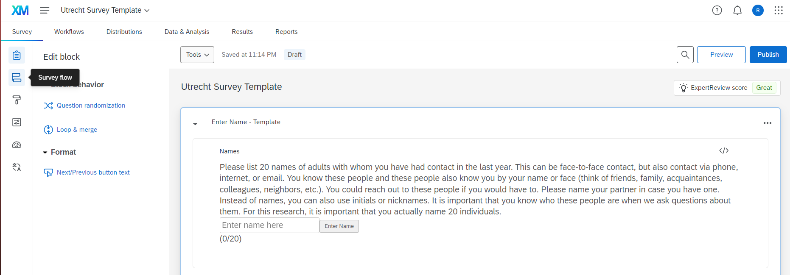
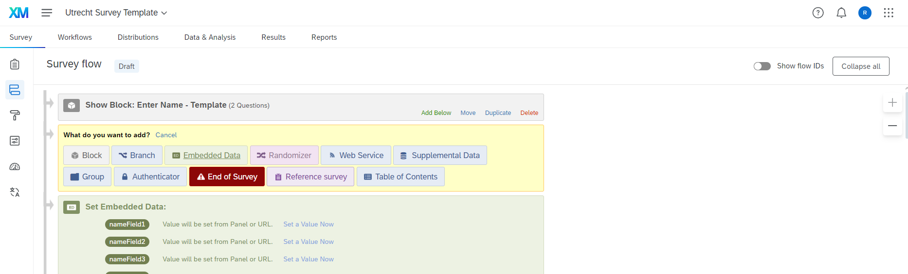
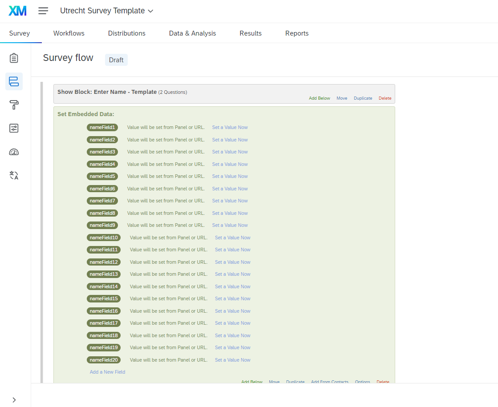
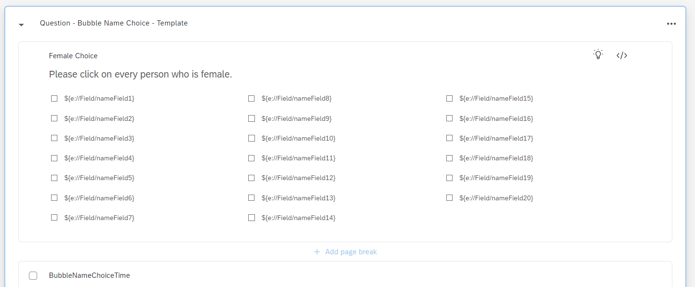

.. _embedded-data-fields:

=============================================
Embedded Data fields
=============================================

Explanation of Predefined Variables in Qualtrics
==================================================
When using Embedded Data fields in Qualtrics, you often need to reference these variables in your survey questions or logic.
To reference an Embedded Data field, you use a specific syntax that tells Qualtrics to substitute the variable with its value.
This syntax involves placing the variable name within a specific format, ensuring Qualtrics recognizes and replaces it correctly during the survey.

Steps to Define Embedded Data Fields
==========================
Embedded Data Fields are user-defined data fields that can store custom values for each survey respondent.
These fields can be used throughout the survey to tailor questions or logic based on previously collected data.

1. Navigate to Survey Flow: In the left sidebar of the Qualtrics survey editor, click on the second item, 'Survey Flow'.

2. Select Question: Choose the question in the Survey Flow where you want to add the Embedded Data Fields.
3. Add Embedded Data: Click 'Add Below' for this question. A window with several options will open.

4. Name Your Variables: Enter the names of your variables. In our example, we use 'nameField' and append numbers 1-20, allowing them to be automatically assigned with JavaScript code.

Once defined, these user-defined variables can be used in other questions or parts of your survey.

Referencing Embedded Data Fields
=====================================
To use the value of an Embedded Data field within a survey question or logic, you must use the specific syntax ${e://Field/YourVariableName}.
This syntax ensures Qualtrics understands that it needs to substitute the placeholder with the actual value stored in the Embedded Data field.

Example
____________
- Suppose you have an Embedded Data field named CostumeValue.
- To use this field in a question, you would write ${e://Field/CostumeValue}.
- During the survey, Qualtrics will replace ${e://Field/CostumeValue} with the actual value of CostumeValue for each respondent.