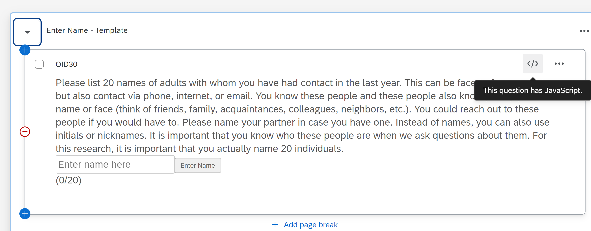

.. _Javascript:

=============================================
JavaScript in Qualtrics
=============================================
In addition to the :ref:`HTML`, there is also JavaScript, which can make all the HTML elements functional. Each question has an extra window for this purpose.

It is important to understand that the JavaScript in Qualtrics is structured differently than usual and that there are various sections.
Here is a basic template of how the JavaScript code typically looks in Qualtrics.

.. code-block:: console

    Qualtrics.SurveyEngine.addOnload(function() {
        // Code to run when the question loads
        var questionId = this.questionId;
        console.log("Question ID: " + questionId);

        // Example: Adding a class to an element
        this.getQuestionContainer().querySelector(".QuestionText").classList.add("myCustomClass");

        // Example: Inserting an HTML element
        var newElement = document.createElement("div");
        newElement.innerHTML = "
This is a custom element.
";
        this.getQuestionContainer().appendChild(newElement);
    });

    Qualtrics.SurveyEngine.addOnReady(function() {
        // Code to run when the page is fully loaded and ready
        var questionId = this.questionId;
        console.log("Page is ready. Question ID: " + questionId);

        // Example: Manipulating answer fields
        var answerField = this.getQuestionContainer().querySelector("input[type='text']");
        if (answerField) {
            answerField.style.backgroundColor = "#f0f0f0";
        }
    });

    Qualtrics.SurveyEngine.addOnUnload(function() {
        // Code to run when the page is unloaded
        var questionId = this.questionId;
        console.log("Page is unloading. Question ID: " + questionId);
    });

Key Methods and Properties
===========================
- Qualtrics.SurveyEngine.addOnload(function): This method adds a function to run when the question loads.
- Qualtrics.SurveyEngine.addOnReady(function): This method adds a function to run when the page is fully loaded and ready.
- Qualtrics.SurveyEngine.addOnUnload(function): This method adds a function to run when the question unloads.
- this.getQuestionContainer(): Returns the HTML element that contains the question.
- this.questionId: The ID of the current question.

Using Functions in JavaScript
=============================
In Qualtrics, you can define JavaScript functions to add interactivity to your HTML elements.

1. Defining JavaScript Functions
_____________________________________
A function in JavaScript is a block of code designed to perform a specific task. You define a function using the function keyword followed by a name, parentheses () which may include parameters, and a block of code {}.

.. code-block:: console

    function myFunction() {
        // Code to be executed
        console.log("Function is called");
    }

2. Using Functions with HTML in Qualtrics
____________________________________________________
To use these functions in your Qualtrics survey, you need to integrate them with your HTML elements.
This is usually done by adding event listeners to your HTML elements so that the functions are called when a user interacts with the elements.

Example: Basic Structure

1. HTML: Create HTML elements in your Qualtrics question.

.. code-block:: console

    
Please enter your name:

    <input type="text" id="nameInput">
    <button id="submitButton">Submit</button>

2. JavaScript: Add JavaScript to interact with these HTML elements.

.. code-block:: console

    Qualtrics.SurveyEngine.addOnload(function() {
    var submitButton = document.getElementById("submitButton");
    var nameInput = document.getElementById("nameInput");

    // Define a function
    function greetUser() {
            var name = nameInput.value;
            alert("Hello, " + name);
        }

        // Add an event listener to the button to call the function when clicked
        submitButton.addEventListener("click", greetUser);
    });

- Defining the Function: The greetUser function is defined to get the value from the nameInput field and display an alert with the user's name.
- Using the Function: The function is used by adding an event listener to the submitButton. When the button is clicked, the greetUser function is called.

By defining functions in JavaScript, you can perform specific tasks when users interact with your HTML elements in Qualtrics.
These functions can validate inputs, manipulate the DOM, and handle various user actions, enhancing the interactivity and functionality of your survey.