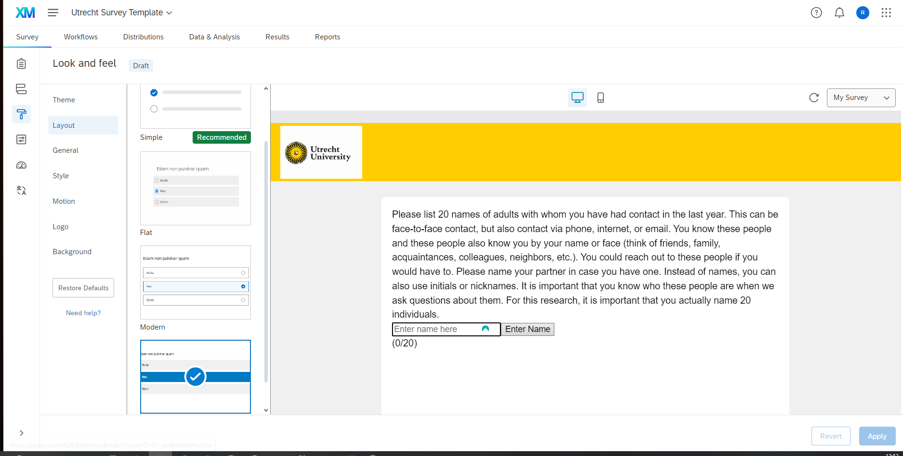

.. _LookAndFeel:

=============================================
Look and Feel
=============================================
The Look and Feel section in Qualtrics is where basic style elements can be defined again.
These changes can affect the entire page or only individual elements.

Layout
===================
The layout plays a fundamental role in design and saves a lot of CSS code that one would otherwise have to write.
For this project, the decision was made to use the 'Modern' layout.

Style
===============
For styling, you can also define the basic colors, font, and size.
The most important thing for our bubble design is the custom CSS so that the bubble radio button selection works.
Only by defining this CSS code here and calling it through JavaScript can the design be applied to a Qualtrics radio button function.

.. code-block:: console

    .custom-multiple-answer {
        color: #ffffff !important;
        border-style: solid !important;
        width: 100px !important;
        height: 100px !important;
        border-radius: 50% !important;
        border-width: 2px !important;
        border-color: #FFCD00 !important;
        background-color: #800080 !important;
        font-size: 16px !important;
        overflow: hidden !important;
    }

    .custom-multiple-answer.q-checked {
        border-color: #800080 !important;
        background-color: #FFCD00 !important;
    }
