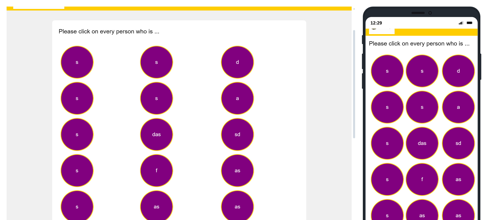
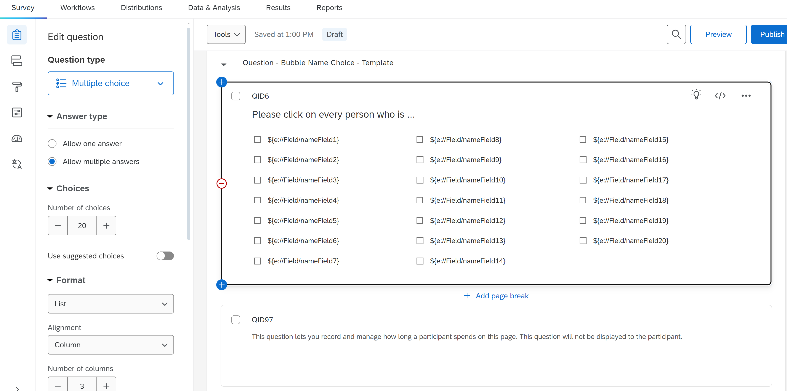

======================
Bubble Name Choice
======================

Description
------------------
This template allows a question to be asked where the participant can choose from the 20 names entered as an answer to the question.
Using custom CSS, the names are displayed within a purple circle.
When names are selected, they turn yellow to give the participant a visual response.

Important
====================
To display the names, you must use the :ref:`embedded-data-fields` defined in the :ref:`EnterName` question.
This is important to ensure the names are displayed and transmitted correctly.

Style
=========================
To design the bubbles as we want, we use the Multiple Choice template directly from Qualtrics.

Look and feel
____________________
To make them look as they should, we use the :ref:LookAndFeel and customize the circles using JavaScript.
We create a custom CSS code for this purpose.

.. code-block:: console

    .custom-multiple-answer {
        color: #ffffff !important;
        border-style: solid !important;
        width: 100px !important;
        height: 100px !important;
        border-radius: 50% !important;
        border-width: 2px !important;
        border-color: #FFCD00 !important;
        background-color: #800080 !important;
        font-size: 16px !important;
        overflow: hidden !important;
    }

    .custom-multiple-answer.q-checked {
        border-color: #800080 !important;
        background-color: #FFCD00 !important;
    }

JavaScript
___________________
We then add this using JavaScript to ensure it is applied.

.. code-block:: console

    Qualtrics.SurveyEngine.addOnload(function() {
        // This will be called once the page is fully loaded and displayed
        // Select all elements with the class 'MultipleAnswer'
        var labels = document.querySelectorAll('.Skin label.MultipleAnswer');

        // Add Flexbox styling to each label to center the content
        labels.forEach(function(label) {
            label.style.display = 'flex';
            label.style.alignItems = 'center';
            label.style.justifyContent = 'center';
            // Add custom-multiple-answer class to each label
            label.classList.add('custom-multiple-answer');
        });
    });

    Qualtrics.SurveyEngine.addOnReady(function() {
        // This will be called once the page is fully loaded and displayed
        // Select all elements with the class 'MultipleAnswer'
        var labels = document.querySelectorAll('.Skin label.MultipleAnswer');

        // Add Flexbox styling to each label to center the content
        labels.forEach(function(label) {
            label.style.display = 'flex';
            label.style.alignItems = 'center';
            label.style.justifyContent = 'center';
            // Add custom-multiple-answer class to each label
            label.classList.add('custom-multiple-answer');
        });

        // Add click event to toggle q-checked class on checked elements
        labels.forEach(function(label) {
            label.addEventListener('click', function() {
                if (label.querySelector('input').checked) {
                    label.classList.add('q-checked');
                } else {
                    label.classList.remove('q-checked');
                }
            });
        });
    });

    Qualtrics.SurveyEngine.addOnUnload(function() {
        /*Place your JavaScript here to run when the page unloads*/
    });

