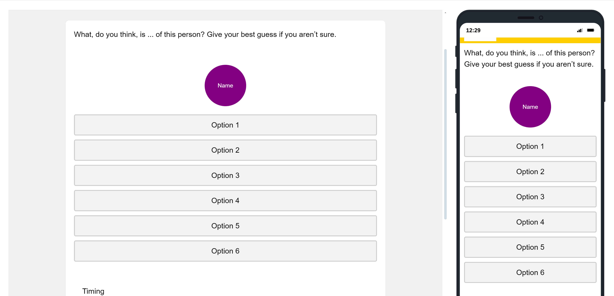

.. _DynamicButton:

===========================
Dynamic Name Radio Buttons
===========================

Description
------------------
Here is the translation of the provided text into English:

---

In this template, one of the 20 names is displayed at the top, and buttons with answer options are shown at the bottom.
When an answer is selected, the button turns green for one second, and the circle with the name fades out.
The next name then fades in, and this process continues until all 20 names have been shown.

The JavaScript interacts with the HTML and CSS to provide a dynamic experience:

- Displays a series of names within a styled circle.
- Allows participants to select options for each name.
- Animates the transition between names.
- Ensures the survey progresses only after all names have been processed.

Code Overview
====================

.. code-block:: console

    Qualtrics.SurveyEngine.addOnload(function() {
    var that = this;
    var currentNameIndex = 1;
    var totalNames = 20;
    var nameCircle = document.getElementById('nameCircle');
	that.hideNextButton();

    function updateCircleName(index) {
        var name = Qualtrics.SurveyEngine.getEmbeddedData('nameField' + index);
        nameCircle.textContent = name;
        nameCircle.style.backgroundColor = 'purple';
        nameCircle.classList.remove('transparent');
    }

    function disableRadioButtons(disable) {
        document.querySelectorAll('.radio-option input').forEach(function(button) {
            button.disabled = disable;
        });
    }

    function resetRadioSelections() {
        document.querySelectorAll('.radio-option input').forEach(function(button) {
            button.checked = false;
            button.parentElement.classList.remove('checked');
        });
    }

    disableRadioButtons(false);

    document.querySelectorAll('.radio-option input').forEach(function(button) {
        button.addEventListener('click', function() {
            disableRadioButtons(true);

            var selectedValue = this.value;
            Qualtrics.SurveyEngine.setEmbeddedData('EmployeeName' + currentNameIndex, selectedValue);

            this.parentElement.classList.add('checked');
            nameCircle.style.backgroundColor = 'green';

            nameCircle.classList.add('transparent');

            setTimeout(function() {
                if (currentNameIndex < totalNames) {
                    currentNameIndex++;
                    updateCircleName(currentNameIndex);
                    resetRadioSelections();
                    disableRadioButtons(false);
                } else {
                    that.enableNextButton();
					that.showNextButton();
                }
            }, 1000);
        });
    });

    updateCircleName(currentNameIndex);
    that.disableNextButton();
    });

Initialization
_______________________
- var that = this; - Saves the context for later use.
- var currentNameIndex = 1; - Starts the index for names.
- var totalNames = 20; - Sets the total number of names.
- var nameCircle = document.getElementById('nameCircle'); - Gets the HTML element for the name circle.
- that.hideNextButton(); - Hides the Next button initially.

Function
___________________

- updateCircleName(index):
    - Fetches the name from embedded data using the index.
    - Updates the nameCircle text and style.
- disableRadioButtons(disable):
    - Enables or disables all radio buttons.
- resetRadioSelections():
    - Unchecks all radio buttons and removes the checked class.

Initial Setup
________________________

When a radio button is clicked:
- Disables all radio buttons.
- Saves the selected value in embedded data.
    - Changes the background color of the nameCircle.
    - Animates the nameCircle to fade out.
    - After a delay, updates the circle with the next name or shows the Next button if all names are processed.

Start
___________________________
- Calls updateCircleName(currentNameIndex); to initialize the first name.
- Disables the Next button initially.