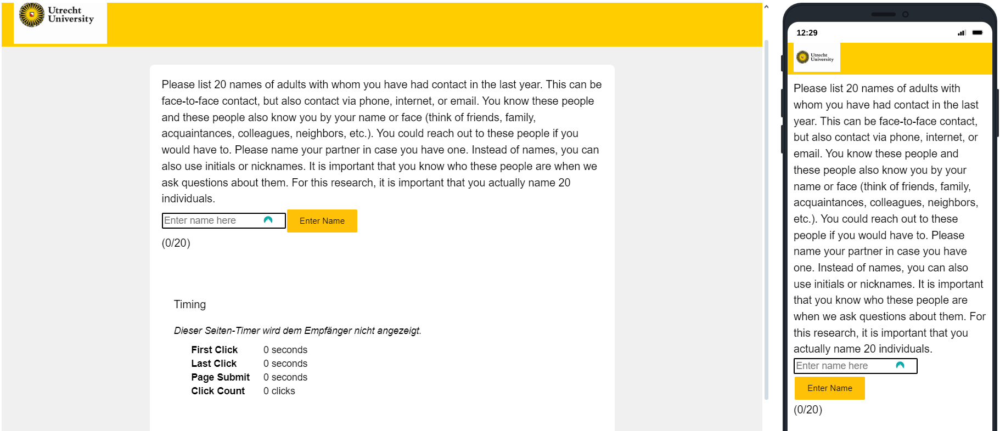

======================
Enter Name Template
======================

Description
------------------
The 'Enter Name' Template in Qualtrics allows participants to enter up to 20 names.
These names are saved in embedded data fields for later use in the project. The template visually displays the entered names in yellow boxes and updates a counter to show how many names have been entered.
The "Continue" button only appears once all 20 names have been entered.

Quick Overview
------------------

1. Entering Names:
    - Participants enter names into the text field and click the "Enter Name" button.
    - Alternatively, pressing the Enter key will also add a name.
    - The input field validates entries, highlighting invalid characters in red.

2. Displaying Names:
    - Entered names are displayed in yellow boxes below the input field.
    - Each box shows the name and a "[x]" to remove the name.
    - The counter below the input field indicates how many names have been entered.

3. Saving and Proceeding:
    - Names are saved in embedded data fields.
    - The "Continue" button is enabled and displayed only when exactly 20 names are entered.

Important
====================
Since the entire code is completely self-created and doesn't always use the functions of Qualtrics one hundred percent, you also need to define the data you want to save yourself.
For this, we use :ref:`embedded-data-fields`.
Hier können die Daten gespeichert und später wieder aufgerufen werden.

JavaScript
====================
The template uses JavaScript to manage names and update the user interface.
Here are the key functions:

Input validation
_________________________
Here, the input of the participants is checked to ensure it contains only letters and umlauts.

.. code-block:: console

        function validateInput() {
        var nameValue = nameInput.value.trim();
        if (/^[a-zA-ZäöüÄÖÜß\s]*$/.test(nameValue)) {
            nameInput.style.borderColor = '';
        } else {
            nameInput.style.borderColor = 'red';
        }
    }

Adding a name:
_______________________________
This is the crucial area where names are added after pressing the Enter key or by pressing the button.

.. code-block:: console

    function addName() {
        var nameValue = nameInput.value.trim();
        if (/^[a-zA-ZäöüÄÖÜß\s]+$/.test(nameValue) && names.length < 20) {
            names.push(nameValue);
            nameInput.value = '';
            nameInput.style.borderColor = '';
            displayNames();
            updateNameCount();
        }
        if (names.length === 20) {
            that.enableNextButton();
            saveNamesToEmbeddedData();
        } else {
            that.disableNextButton();
        }
        setTimeout(function() {
            nameInput.focus();
        }, 100);
    }

For the visual representation, the `DisplayNames()` function is called to display the names below the input field, and the `updateNameCount()` function is called to update the counter so that participants know how many names they still need to enter.

Display Names
____________________________
This is the function responsible for displaying the names along with the "x" icon, indicating to participants that they can remove the names.

.. code-block:: console

    function displayNames() {
        nameListDiv.innerHTML = '';
        names.forEach(function(name, index) {
            var nameSpan = document.createElement("span");
            nameSpan.className = "nameSpan";
            nameSpan.textContent = '[x] ' + name;
            nameSpan.onclick = function() {
                names.splice(index, 1);
                displayNames();
                updateNameCount();
                if (names.length < 20) {
                    that.disableNextButton();
                }
            };
            nameListDiv.appendChild(nameSpan);
        });
    }

Update Counter
_________________________________
This function updates the counter, indicating how many names have been entered.

.. code-block:: console

    function updateNameCount() {
        nameCount.textContent = '(' + names.length + '/20)';
        if (names.length === 20) {
            that.enableNextButton();
        } else {
            that.disableNextButton();
        }
    }

Save the name Values
____________________________
This function saves the names in the backend.
It's important that in the SurveyFlow for this question, :ref:`embedded-data-fields` have been defined so that this data can be truly saved and can be used later on.

.. code-block:: console

    function updateNameCount() {
        nameCount.textContent = '(' + names.length + '/20)';
        if (names.length === 20) {
            that.enableNextButton();
        } else {
            that.disableNextButton();
        }
    }

Styling of the Template
=========================
We can use CSS to style our template in Qualtrics.

.. code-block:: console

    #addNameButton {
        background-color: #FFC107; /* Set the background color to yellow */
        border: 1px solid #FFC107; /* Add a yellow border */
        color: black; /* Set the text color to black */
        padding: 10px 20px; /* Add padding around the button for spacing */
        text-align: center; /* Center-align the text inside the button */
        text-decoration: none; /* Remove any text decoration (like underlines) */
        display: inline-block; /* Display the button as an inline-block element */
        font-size: 14px; /* Set the font size to 14 pixels */
        margin: 4px 2px; /* Add margins around the button for spacing */
        cursor: pointer; /* Change the cursor to a pointer when hovering over the button */
        border-radius: 2px; /* Slightly round the corners of the button */
    }

    .nameSpan {
        background-color: rgba(255, 255, 224, 0.8); /* Set the background color to light yellow with 80% opacity */
        border: 1px solid #ffd700; /* Add a golden border */
        border-radius: 5px; /* Round the corners of the span */
        padding: 4px 8px; /* Add padding inside the span for spacing */
        margin: 0 5px 5px 0; /* Add margins around the span for spacing */
        display: inline-block; /* Display the span as an inline-block element */
        box-shadow: 1px 1px 1px #888888; /* Add a slight shadow to the span for a 3D effect */
        cursor: pointer; /* Change the cursor to a pointer when hovering over the span */
        font-size: 0.85em; /* Set the font size to 85% of the default size */
    }
