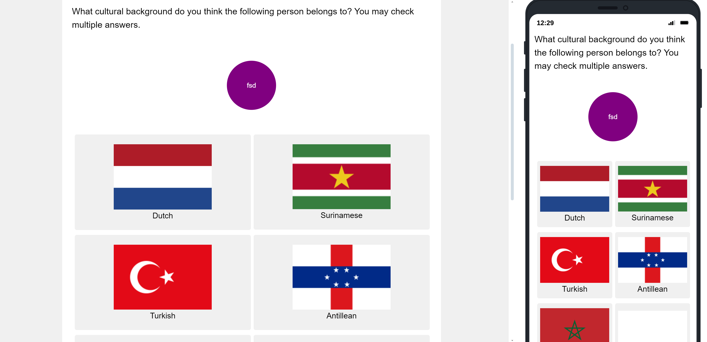
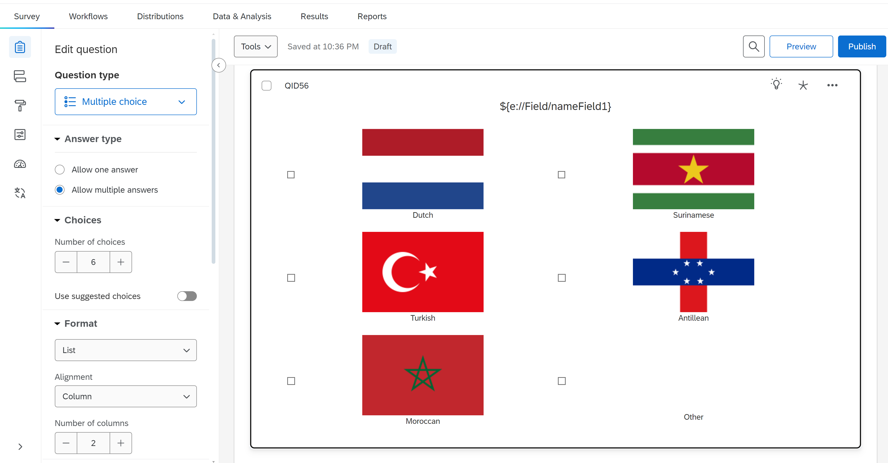

===========================
Flag Buttons
===========================

Description
==============
This template is relatively simple as it uses the MultipleChoice function of Qualtrics and only displays the flags using HTML.

You can display the flags using this code.

.. code-block:: console

    
 Name
