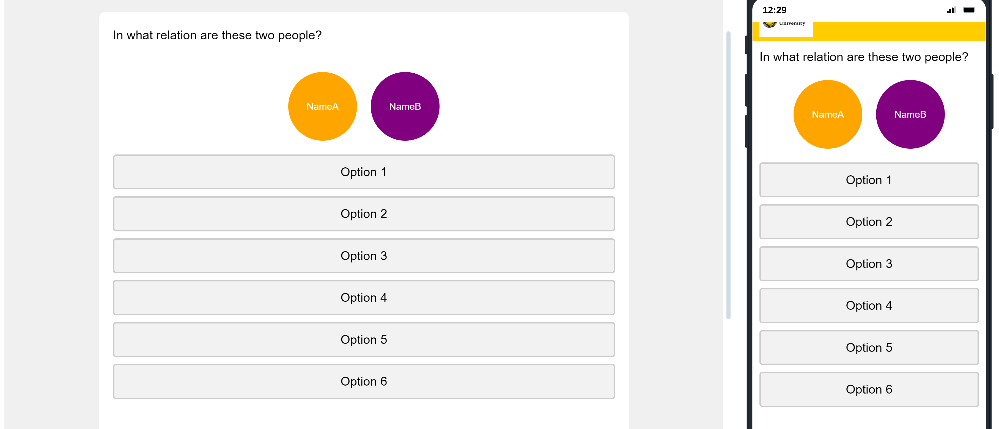

.. _Relationship:

======================
Relationship
======================

Description
==============
In this template, participants determine the relationship between two names.
The name on the left is fixed, while the name on the right changes. After clicking a button, the right circle fades out and a new name appears.
Once all names on the right have been shown, the left circle turns red, fades out, and then the next name appears.
All relationships are checked without repetition.

Quick Overview
------------------

1. Displaying Names:
    - Two circles are displayed with names inside them.
    - The left circle has an orange background, and the right circle has a purple background.

2. Answer Selection:
    - Below the circles, there are multiple-choice answer buttons.
    - When a button is clicked, the selected answer is stored, the right circle turns green momentarily, and then the names update to the next pair.

3. Name and Answer Management:
    - Names are fetched from embedded data fields.
    - The progress through the names is saved and can be resumed if the page is revisited.

Important
====================
It is important to define all embedded fields, which can be time-consuming as there are many.

Code Overview
====================
The template uses JavaScript to manage names, handle user interactions, and update the user interface.

JavaScript
=================

Updating Circle Names
_________________________

This function updates the names displayed in the circles.

.. code-block:: console

    function updateCircleNames(leftIndex, rightIndex) {
        var leftName = Qualtrics.SurveyEngine.getEmbeddedData('nameField' + leftIndex);
        var rightName = Qualtrics.SurveyEngine.getEmbeddedData('nameField' + rightIndex);
        leftCircle.textContent = leftName;
        rightCircle.textContent = rightName;
        leftCircle.style.backgroundColor = 'orange';
        rightCircle.style.backgroundColor = 'purple';
        leftCircle.classList.remove('transparent');
        rightCircle.classList.remove('transparent');
    }

Disabling Radio Buttons
_________________________

This function disables all radio buttons to prevent multiple selections.

.. code-block:: console

    function disableRadioButtons(disable) {
        document.querySelectorAll('.radio-option input').forEach(function(button) {
            button.disabled = disable;
        });
    }

Resetting Radio Selections
_________________________

This function resets all radio button selections and styles.

.. code-block:: console

    function resetRadioSelections() {
        document.querySelectorAll('.radio-option input').forEach(function(button) {
            button.checked = false;
            button.parentElement.classList.remove('checked');
        });
    }

Saving Progress
_________________________

This function saves the current progress of name indices.

.. code-block:: console

    function saveProgress() {
        Qualtrics.SurveyEngine.setEmbeddedData('currentLeftIndex', currentLeftIndex);
        Qualtrics.SurveyEngine.setEmbeddedData('currentRightIndex', currentRightIndex);
    }

CSS for Styling
=========================
We use CSS to style the circles and radio buttons.

.. code-block:: console

    .circle {
        width: 100px;
        height: 100px;
        border-radius: 50%;
        color: white;
        display: flex;
        align-items: center;
        justify-content: center;
        font-size: 14px;
        margin: 0 10px; /* Space between circles */
        text-align: center; /* Ensures text is centered */
        line-height: 1.2; /* Ensures multiline text is centered */
    }

    #leftCircle {
        background-color: orange;
    }

    #rightCircle {
        background-color: purple;
    }

    .container {
        display: flex;
        justify-content: center; /* Centers the circles horizontally */
        margin-bottom: 20px; /* Space below the circles */
    }

    .radio-option {
        background-color: #f2f2f2; /* Background color of the buttons */
        border: 2px solid #cccccc; /* Border of the buttons */
        border-radius: 4px; /* Slightly rounded corners for buttons */
        padding: 10px 20px; /* Padding inside the buttons */
        margin: 10px 0; /* Space between the buttons */
        cursor: pointer;
        user-select: none;
        display: block; /* Ensures the label has block element properties */
        text-align: center;
    }

    .radio-option input {
        opacity: 0; /* Makes the actual radio element invisible */
        position: absolute; /* Positions it out of the document flow */
        cursor: pointer;
    }

    .radio-option:hover {
        background-color: #e6e6e6; /* Hover effect for the buttons */
    }

    .radio-option.checked {
        background-color: #4CAF50; /* Color for the selected option */
        color: white;
        border: 2px solid #4CAF50; /* Border color for the selected option */
    }

    .transparent {
        animation: fadeOut 1s forwards; /* Animation that sets transparency to 0 */
    }

    //Animation
    @keyframes fadeOut {
        to {
            opacity: 0;
        }
    }

HTML
=========================
The HTML structure includes the circles and radio buttons.

.. code-block:: console

    
 <!-- Container to hold both circles -->
        
Name1
 <!-- Left circle with a fixed name -->
        
Name2
 <!-- Right circle with a changing name -->
    

    
 <!-- Container for the radio button options -->
        <label class="radio-option">Option 1<input value="Option 1" type="radio" name="RelationValues"></label> <!-- Radio button for option 1 -->
        <label class="radio-option">Option 2<input value="Option 2" type="radio" name="RelationValues"></label> <!-- Radio button for option 2 -->
        <label class="radio-option">Option 3<input value="Option 3" type="radio" name="RelationValues"></label> <!-- Radio button for option 3 -->
        <label class="radio-option">Option 4<input value="Option 4" type="radio" name="RelationValues"></label> <!-- Radio button for option 4 -->
        <label class="radio-option">Option 5<input value="Option 5" type="radio" name="RelationValues"></label> <!-- Radio button for option 5 -->
        <label class="radio-option">Option 6<input value="Option 6" type="radio" name="RelationValues"></label> <!-- Radio button for option 6 -->
    

JavaScript Implementation
=========================
The JavaScript code handles the interaction logic.

.. code-block:: console

    Qualtrics.SurveyEngine.addOnload(function() {
        var that = this; // Save the current context
        var totalNames = 20; // Total number of names
        var leftCircle = document.getElementById('leftCircle'); // Get the left circle element
        var rightCircle = document.getElementById('rightCircle'); // Get the right circle element
        that.hideNextButton(); // Hide the Next button initially

        var currentLeftIndex = parseInt(Qualtrics.SurveyEngine.getEmbeddedData('currentLeftIndex')) || 1; // Get the current left name index or default to 1
        var currentRightIndex = parseInt(Qualtrics.SurveyEngine.getEmbeddedData('currentRightIndex')) || 2; // Get the current right name index or default to 2

        // Function to update the names displayed in the circles
        function updateCircleNames(leftIndex, rightIndex) {
            var leftName = Qualtrics.SurveyEngine.getEmbeddedData('nameField' + leftIndex); // Get the left name from embedded data
            var rightName = Qualtrics.SurveyEngine.getEmbeddedData('nameField' + rightIndex); // Get the right name from embedded data
            leftCircle.textContent = leftName; // Update the text in the left circle
            rightCircle.textContent = rightName; // Update the text in the right circle
            leftCircle.style.backgroundColor = 'orange'; // Set the background color of the left circle to orange
            rightCircle.style.backgroundColor = 'purple'; // Set the background color of the right circle to purple
            leftCircle.classList.remove('transparent'); // Ensure the left circle is not transparent
            rightCircle.classList.remove('transparent'); // Ensure the right circle is not transparent
        }

        // Function to disable or enable all radio buttons
        function disableRadioButtons(disable) {
            document.querySelectorAll('.radio-option input').forEach(function(button) {
                button.disabled = disable; // Set the disabled property of each radio button
            });
        }

        // Function to reset all radio button selections and styles
        function resetRadioSelections() {
            document.querySelectorAll('.radio-option input').forEach(function(button) {
                button.checked = false; // Uncheck each radio button
                button.parentElement.classList.remove('checked'); // Remove the checked class from each button's parent element
            });
        }

        // Function to save the current progress of name indices
        function saveProgress() {
            Qualtrics.SurveyEngine.setEmbeddedData('currentLeftIndex', currentLeftIndex); // Save the current left index to embedded data
            Qualtrics.SurveyEngine.setEmbeddedData('currentRightIndex', currentRightIndex); // Save the current right index to embedded data
        }

        disableRadioButtons(false); // Enable all radio buttons initially

        // Add event listeners to each radio button
        document.querySelectorAll('.radio-option input').forEach(function(button) {
            button.addEventListener('click', function() {
                disableRadioButtons(true); // Disable all radio buttons when one is clicked

                var selectedValue = this.value; // Get the value of the clicked radio button
                var relationField = 'RelationName' + currentLeftIndex + 'Name' + currentRightIndex; // Create the embedded data field name
                Qualtrics.SurveyEngine.setEmbeddedData(relationField, selectedValue); // Save the selected value to embedded data

                this.parentElement.classList.add('checked'); // Add the checked class to the parent element of the clicked button
                rightCircle.style.backgroundColor = 'green'; // Change the background color of the right circle to green
                rightCircle.classList.add('transparent'); // Make the right circle transparent

                // Delay to handle the transition and update of names
                setTimeout(function() {
                    if (currentRightIndex == totalNames) { // Check if all right names have been shown
                        leftCircle.style.backgroundColor = 'red'; // Change the background color of the left circle to red
                        setTimeout(function() {
                            leftCircle.classList.add('transparent'); // Make the left circle transparent
                            setTimeout(function() {
                                leftCircle.style.backgroundColor = 'orange'; // Reset the background color of the left circle to orange
                                leftCircle.classList.remove('transparent'); // Make the left circle visible again
                                currentRightIndex++; // Increment the right index
                                if (currentRightIndex > totalNames) { // If right index exceeds total names, increment left index
                                    currentLeftIndex++;
                                    if (currentLeftIndex >= totalNames) { // If left index exceeds or equals total names, show the Next button
                                        that.enableNextButton();
                                        that.showNextButton();
                                        return;
                                    }
                                    currentRightIndex = currentLeftIndex + 1; // Set right index to one more than the left index
                                }
                                updateCircleNames(currentLeftIndex, currentRightIndex); // Update the circle names
                                resetRadioSelections(); // Reset radio selections
                                disableRadioButtons(false); // Enable radio buttons
                                saveProgress(); // Save progress
                            }, 1000);
                        }, 1000);
                    } else {
                        currentRightIndex++; // Increment the right index
                        if (currentRightIndex > totalNames) { // If right index exceeds total names, increment left index
                            currentLeftIndex++;
                            if (currentLeftIndex >= totalNames) { // If left index exceeds or equals total names, show the Next button
                                that.enableNextButton();
                                that.showNextButton();
                                return;
                            }
                            currentRightIndex = currentLeftIndex + 1; // Set right index to one more than the left index
                        }
                        updateCircleNames(currentLeftIndex, currentRightIndex); // Update the circle names
                        resetRadioSelections(); // Reset radio selections
                        disableRadioButtons(false); // Enable radio buttons
                        saveProgress(); // Save progress
                    }
                }, 1000);
            });
        });

        updateCircleNames(currentLeftIndex, currentRightIndex); // Initial call to update the circle names
        that.disableNextButton(); // Disable the Next button initially
        saveProgress(); // Save initial progress
    });